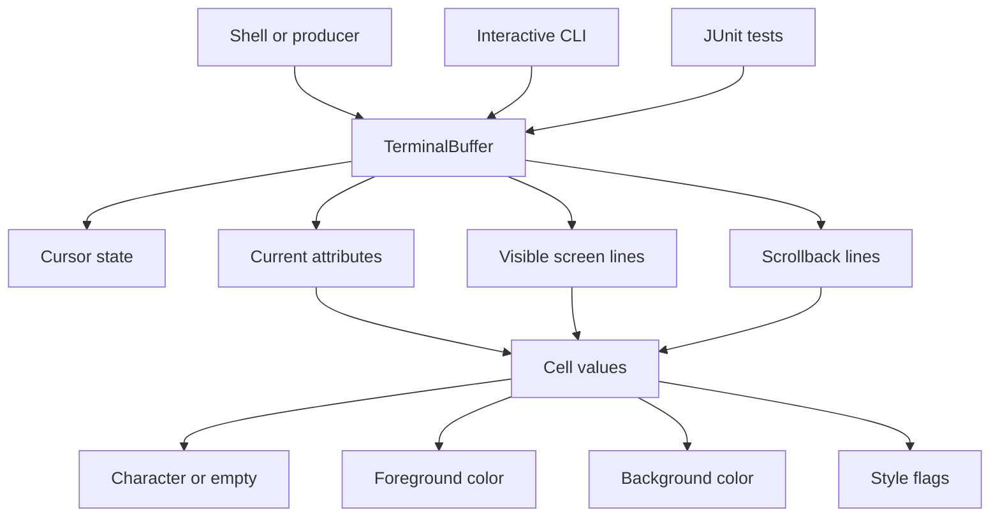

# Terminal Buffer

This is my small project for implementing a terminal text buffer in Kotlin.
The project focuses on the core data structure that a terminal emulator would use
to store visible text, preserve scrollback history, and track cursor state.

It is intentionally a library-first implementation with a small interactive CLI,
not a full terminal UI. The buffer is the interesting part here: shells write into it,
and a richer renderer or UI could sit on top later.

## Architecture



## What exists

- `TerminalBuffer` supports configurable width, height, and maximum scrollback size.
- The project now includes an interactive CLI for manually exercising the buffer.
- The buffer stores screen content separately from scrollback history.
- Each cell stores a `CellKind` plus foreground color, background color, and style flags.
- The buffer tracks current attributes that are applied to future edits.
- Cursor position can be read, set, and moved with bounds clamping.
- Editing supports overwrite writes, insert writes, line fill, bottom-line insertion, screen clear, and screen+scrollback clear.
- Content access supports reading cells, lines, visible screen content, and combined history+screen content.
- The project includes behavior-focused unit tests with edge cases and boundary conditions.

## Solution overview

The implementation keeps the model small on purpose.
`TerminalBuffer` owns the mutable state: screen lines, scrollback lines, current attributes,
and cursor position. `Cell` and `CellAttributes` are immutable value types so written content
keeps the attributes it had at write time.

The cell model now uses three explicit states:

- `CellKind.Empty`
- `CellKind.GraphemeStart(text, displayWidth)`
- `CellKind.Continuation`

That lets the buffer represent both normal single-cell text and wide characters more cleanly.
A wide grapheme is stored as one lead cell plus one continuation cell.

The visible screen is stored as a fixed-height list of lines. Each line contains a fixed number
of cells. Scrollback is stored as a bounded FIFO list of lines. When content moves past the bottom
of the screen, the top visible line is moved into scrollback and the oldest scrollback line is
discarded if the configured capacity is exceeded.

This keeps the architecture clear and easy to test, even if it is not the most optimized possible
representation for a real production terminal emulator.

## Trade-offs and decisions

- The project is delivered as a library plus a simple CLI, not a full terminal app. The spec asks for the terminal buffer core data structure, and the tests still act as the main behavior documentation.
- The model favors readability and clean code over aggressive optimization.
- Cells are immutable values, which makes tests and behavior easier to reason about.
- Wide characters are modeled explicitly as grapheme-start plus continuation cells rather than as raw chars in isolated cells.
- Screen and history access are exposed through explicit read methods instead of exposing internal collections.
- There is no ANSI parser, renderer, or escape-sequence handling in this project.
- The CLI is intentionally line-based and lightweight rather than a curses-style TUI.
- Full Unicode grapheme-cluster handling and resize behavior are still future improvements.

## Example usage in code

```kotlin
val buffer = TerminalBuffer(width = 8, height = 3, maxScrollbackLines = 10)

buffer.writeText("hello")
buffer.setCursorPosition(column = 1, row = 0)
buffer.insertText("X")
buffer.fillLine('=')

println(buffer.getScreenContent())
println(buffer.getHistoryContent())
```

For concrete behavior examples, see `src/test/kotlin/terminal/buffer/TerminalBufferTest.kt`.
For CLI behavior, see `src/test/kotlin/terminal/buffer/TerminalBufferCliTest.kt`.

## Local development

Run tests:

```sh
./gradlew test
```

Run the interactive CLI:

```sh
./gradlew run
```

For actual interactive use, Gradle's progress UI can get in the way.
These are better options:

```sh
./gradlew --console=plain -q run
```

Or install and run the CLI directly:

```sh
./gradlew installDist
./build/install/terminal-buffer/bin/terminal-buffer
```

Example CLI session:

```text
help
write hello
show
set-cursor 1 0
insert X
set-attrs green default bold
attrs
fill =
history
quit
```

The CLI is intentionally simple: it is a manual playground for the buffer, not a terminal emulator UI.

## Layout

- `src/main/kotlin/terminal/buffer/TerminalBuffer.kt` - main buffer implementation
- `src/main/kotlin/terminal/buffer/TerminalBufferCli.kt` - interactive CLI and command handling
- `src/main/kotlin/terminal/buffer/Cell.kt` - cell value type
- `src/main/kotlin/terminal/buffer/CellKind.kt` - empty, grapheme-start, and continuation cell states
- `src/main/kotlin/terminal/buffer/CellAttributes.kt` - foreground/background/style attributes
- `src/main/kotlin/terminal/buffer/TerminalColor.kt` - 16-color terminal palette plus default
- `src/main/kotlin/terminal/buffer/TextStyle.kt` - supported text styles
- `src/test/kotlin/terminal/buffer/TerminalBufferTest.kt` - behavior and edge-case tests
- `src/test/kotlin/terminal/buffer/TerminalBufferCliTest.kt` - CLI and command behavior tests
- `docs/plans` - implementation planning documents used during development

## Improvements I would make next

- Add explicit `getCharacterAt` and `getAttributesAt` methods if the public API should mirror the spec wording more directly.
- Implement wide-character support for CJK and emoji.
- Implement resize behavior with clearly defined retention rules.
- Revisit some naming around `history` vs `screen + scrollback` accessors to make the API even more explicit.
- Improve CLI ergonomics with better argument parsing and maybe command aliases.

## Submission notes

- The repository includes source code, a Gradle build, and comprehensive tests.
- The git history is incremental and uses Conventional Commits.
- Feature work was intentionally kept separate from later test-hardening work.
- Before external submission, add the public GitHub or GitLab repository link here.
