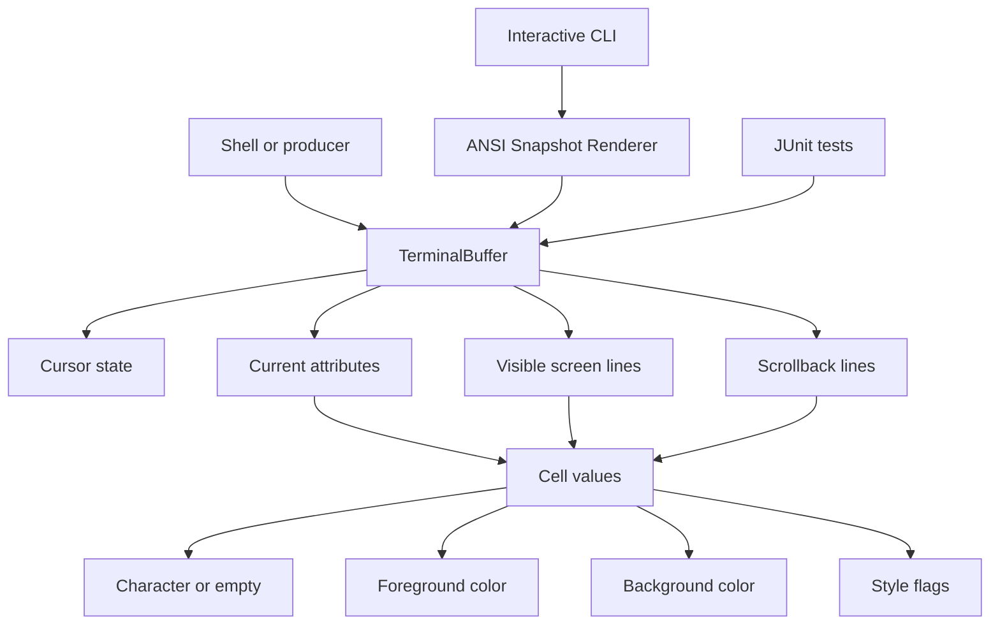

# Terminal Buffer

This is my small project for implementing a terminal text buffer in Kotlin.
It focuses on the core data structure a terminal emulator would use to store visible text,
preserve scrollback, and track cursor state.

It is intentionally library-first with a small interactive CLI, not a full terminal UI.
The buffer is the interesting part here: shells write into it, and a renderer or richer UI
could sit on top later.

## Architecture



## What exists

- `TerminalBuffer` supports configurable width, height, and maximum scrollback size.
- The buffer stores screen content separately from scrollback history.
- Each cell stores a `CellKind` plus foreground color, background color, and style flags.
- The buffer tracks current attributes that are applied to future edits.
- Cursor position can be read, set, and moved with bounds clamping.
- Editing supports overwrite writes, insert writes, delete-at-cursor behavior, backspace behavior, line fill, bottom-line insertion, screen clear, and screen+scrollback clear.
- Editing also supports `resize(newWidth, newHeight)` with grapheme-safe reflow for wrapped content.
- Content access supports cells, characters, attributes, lines, visible screen content, and combined history+screen content.
- The project includes an interactive CLI for manually exercising the buffer.
- `show` can render the visible screen with ANSI colors and text styles.
- The project includes behavior-focused unit tests with edge cases and boundary conditions.

## Solution overview

The implementation keeps the model small on purpose.
`TerminalBuffer` owns the mutable state: visible rows, scrollback rows, current attributes,
and cursor position. `Cell` and `CellAttributes` are immutable value types so written content
keeps the attributes it had at write time.

The cell model now uses three explicit states:

- `CellKind.Empty`
- `CellKind.GraphemeStart(text, displayWidth)`
- `CellKind.Continuation`

That lets the buffer represent both normal single-cell text and wide characters more cleanly.
A wide grapheme is stored as one lead cell plus one continuation cell.

The visible screen is stored as a fixed-height list of rows. Wrapped rows carry lightweight
continuation metadata, and resize/edit operations can regroup those rows into logical grapheme
content when they need to reflow. Scrollback is stored as a bounded FIFO list of rows.

This keeps the architecture clear and easy to test, even if it is not the most optimized
representation for a real production terminal emulator.

## Local development

Run tests:

```sh
./gradlew test
```

Run the interactive CLI:

```sh
./gradlew run
```

For actual interactive use, Gradle's progress UI can get in the way. Better options:

```sh
./gradlew --console=plain -q run
```

```sh
./gradlew installDist
./build/install/terminal-buffer/bin/terminal-buffer
```

Example CLI session:

```text
help
write hello 日本 💛
set-cursor 1 0
set-attrs bright_cyan blue bold underline
insert X
delete 1
backspace
history
set-cursor 0 3
set-attrs bright_yellow default italic
write privit 🇺🇦 ❤️
show
resize 6 3
cursor
clear-all
reset
quit
```

The CLI is intentionally simple: it is a manual playground for the buffer, not a terminal emulator UI.

- `show` renders the visible screen with ANSI colors and styles when the terminal supports them.
- `write <text>` and `insert <text>` treat everything after the command name as raw text.
- `delete <count>` removes characters at the cursor and shifts the rest of the row left.
- `backspace` removes the grapheme before the cursor and shifts the rest of the row left.
- `fill <char|empty>` accepts either `empty` or the first character after `fill `.
- `resize <width> <height>` changes the visible dimensions and reflows wrapped content by grapheme.
- `set-attrs <fg> <bg> <styles...>` uses names like `default`, `green`, `bright_red`, `bold`, `italic`, and `underline`.
- `history` prints scrollback plus the current screen, while `screen` prints only the visible screen.

Terminal styling here is limited to what the terminal supports: color, bold, italic, and underline. Things like actual font size are controlled by the terminal emulator, not by this program.

For concrete behavior examples, see `src/test/kotlin/terminal/buffer/TerminalBufferTest.kt`.
For behavior-doc tests, see `src/test/kotlin/terminal/buffer/TerminalBufferBehaviorTest.kt` and `src/test/kotlin/terminal/buffer/TerminalBufferCliBehaviorTest.kt`.

## Trade-offs and decisions

- Cells are immutable values, which makes tests and behavior easier to reason about.
- Wide characters are modeled explicitly as grapheme-start plus continuation cells rather than as raw chars in isolated cells.
- There is still no ANSI parser or escape-sequence interpreter.
- Resize is grapheme-safe and reflows wrapped content, but it still relies on pragmatic wrap metadata rather than a full terminal parser.

## Example usage in code

```kotlin
val buffer = TerminalBuffer(width = 8, height = 3, maxScrollbackLines = 10)

buffer.writeText("hello")
buffer.setCursorPosition(column = 1, row = 0)
buffer.insertText("X")
buffer.deleteCharacters(1)
buffer.backspace()
buffer.fillLine('=')

println(buffer.getScreenContent())
println(buffer.getHistoryContent())
```

## Unicode notes

The buffer stores visible text as grapheme-oriented cells:

- `CellKind.Empty`
- `CellKind.GraphemeStart(text, displayWidth)`
- `CellKind.Continuation`

This means a visible grapheme like `界`, `👍🏻`, `🇵🇱`, or `👨‍👩‍👧‍👦` is treated as one logical write unit.
If it takes two terminal cells, the buffer stores one grapheme-start cell followed by one continuation cell.

Covered cases include ASCII text, combining-mark sequences like `é`, emoji modifier sequences like `👍🏻`, ZWJ sequences like `👨‍👩‍👧‍👦`, flag sequences like `🇵🇱`, and wide CJK characters like `界`.

The segmentation and width logic is pragmatic rather than fully Unicode-complete, but it avoids the broken spacing and codepoint-splitting behavior the earlier version had.

One important detail: string reconstruction APIs like `getScreenLine()` return visible grapheme text plus blanks for truly empty cells. Continuation cells are not rendered as extra spaces.

## Layout

- `src/main/kotlin/terminal/buffer/TerminalBuffer.kt` - main buffer implementation
- `src/main/kotlin/terminal/buffer/TerminalBufferCli.kt` - interactive CLI and command handling
- `src/main/kotlin/terminal/buffer/Cell.kt` - cell value type
- `src/main/kotlin/terminal/buffer/CellKind.kt` - empty, grapheme-start, and continuation cell states
- `src/main/kotlin/terminal/buffer/Grapheme.kt` - internal grapheme model
- `src/main/kotlin/terminal/buffer/GraphemeSegmenter.kt` - pragmatic grapheme segmentation
- `src/main/kotlin/terminal/buffer/GraphemeWidth.kt` - grapheme display width rules
- `src/main/kotlin/terminal/buffer/BufferRow.kt` - visible row plus wrap-continuation metadata
- `src/main/kotlin/terminal/buffer/LogicalLine.kt` - temporary logical grapheme grouping for reflow-aware operations
- `src/main/kotlin/terminal/buffer/ScreenLine.kt` - internal line abstraction used for grapheme-safe row operations
- `src/main/kotlin/terminal/buffer/StyledGrapheme.kt` - grapheme plus attributes for reflow and editing
- `src/main/kotlin/terminal/buffer/AnsiSnapshotRenderer.kt` - ANSI-styled CLI snapshot rendering for `show`
- `src/main/kotlin/terminal/buffer/CellAttributes.kt` - foreground/background/style attributes
- `src/main/kotlin/terminal/buffer/TerminalColor.kt` - 16-color terminal palette plus default
- `src/main/kotlin/terminal/buffer/TextStyle.kt` - supported text styles
- `src/test/kotlin/terminal/buffer/TerminalBufferTest.kt` - detailed behavior and edge-case tests
- `src/test/kotlin/terminal/buffer/TerminalBufferCliTest.kt` - CLI and command behavior tests
- `src/test/kotlin/terminal/buffer/TerminalBufferBehaviorTest.kt` - high-level buffer behavior documentation tests
- `src/test/kotlin/terminal/buffer/TerminalBufferCliBehaviorTest.kt` - high-level CLI behavior documentation tests
- `docs/plans` - implementation planning documents used during development

## Improvements I would make next

- Follow the terminal emulator rabbit hole further with more complex ANSI behavior, cursor modes, and similar features.
- Tighten grapheme segmentation and width measurement toward fuller Unicode correctness.
- Make all operations operate directly on logical content instead of buffer rows.
- Add a real terminal control layer with newline/carriage-return semantics, tab handling, erase-in-line / erase-in-display operations, and more faithful cursor movement rules.
- Introduce first-class viewport and scroll position handling so history navigation, rendering, and buffer mutation are separated more cleanly.
- Add an ANSI parser/state machine so the buffer can consume realistic terminal output streams instead of only direct API calls and CLI commands.
- Full Unicode grapheme-boundary correctness across all edge cases.
